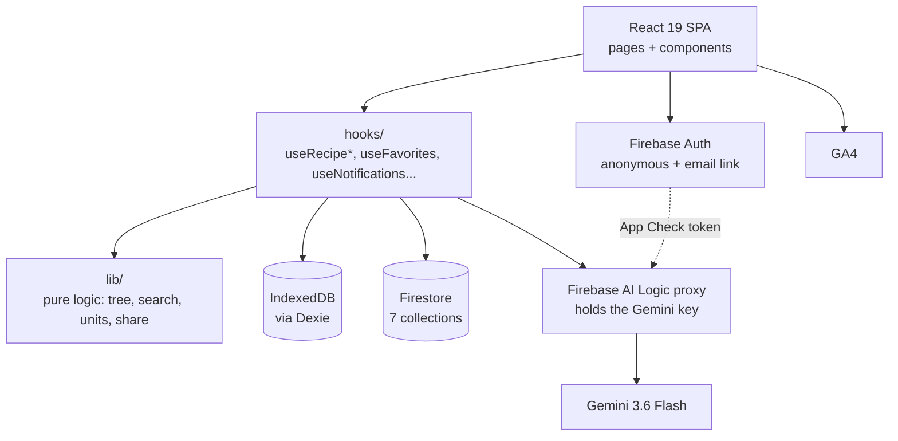

# Architecture

Verified against the code on 2026-07-31.

## Shape

A mobile-first React SPA with no backend of its own. Two stores (IndexedDB and Firestore),
one AI path (a Google-hosted proxy), and one deployed artefact (static files on Firebase
Hosting). There is no server the project operates: the `functions/` directory exists but is
undeployed.

## Layers

**`pages/`** own routing-level state and compose components. **`components/`** are
presentational, grouped by domain (`recipe/`, `chat/`, `auth/`, `profile/`,
`notifications/`, `layout/`) plus a shared `ui/` primitive set (Button, Input, Chip,
Skeleton, EmptyState, ConfirmDialog, FAB, Spinner, Avatar, SegmentedControl). **`hooks/`**
hold all data access and effects. **`lib/`** is pure, dependency-free logic and is where
the tests live. **`services/`** wrap the outside world: Firebase init, Firestore CRUD,
Gemini, localStorage, analytics.

The rule that keeps this honest: nothing in `lib/` imports from `services/` or `hooks/`.
That is why `lib/` is testable in node with no mocks beyond `fake-indexeddb`.

## Dual storage

Every recipe the user saves is written twice: to IndexedDB via Dexie (authoritative for
the local library, instant, works offline for reads) and to Firestore (authoritative for
the shared library, favourites, and social features). The write order is local first so the
UI never waits on the network, and a failed cloud publish surfaces as a message rather than
being swallowed.

The consequence to keep in mind: **the two stores can disagree.** A recipe published by
another user exists only in the cloud, so local-only features (the version tree, local
search) cannot see all of it. A recipe deleted locally may still have a cloud copy. Most of
the roadmap's data items are about narrowing that gap.

## The AI path

`services/gemini.ts` calls Gemini through **Firebase AI Logic** (`firebase/ai`), a
Google-hosted proxy. This is the single most important architectural fact:

- The Gemini API key **never reaches the browser**. Firebase provisions and holds it
  server-side. There is deliberately no `VITE_GEMINI_*` env var; `VITE_*` values are
  inlined into the bundle at build time, so a key there would be published.
- **App Check is enforced on this path.** Without a valid attestation token the proxy
  rejects the request, which is why `VITE_RECAPTCHA_SITE_KEY` is required for generation
  and why localhost needs a registered debug token.
- Prompts are still constructed client-side (`lib/prompts.ts`). This is a known and
  accepted limit: a determined user can send arbitrary prompts through your quota. The
  accepted mitigation is App Check plus a `responseSchema` on the model config, which is
  now in place — it does not stop a misused request, it narrows what one can *return* to
  "a valid recipe". The undeployed `functions/generateRecipe` is the escalation path if
  abuse ever appears — it owns the prompts server-side and rate-limits per account, but it
  needs the Blaze plan and would end the free Gemini tier.

**One schema, three consumers.** `schemas/recipe.responseSchema.ts` builds the recipe shape
with the SDK's `Schema` builders. `gemini.ts` passes it as `responseSchema`, and
`lib/prompts.ts` serialises the *same object* into the system prompt rather than keeping a
hand-written second copy — that copy existed until 2026-07-31 and nothing kept it in step.
Zod (`schemas/recipe.schema.ts`) is a deliberate fourth description, hand-written because
`zod-to-json-schema` is incompatible with Zod v4; a test asserts the two agree on their key
set so they cannot drift silently.

Output is trusted at exactly one boundary: `parseRecipeJson` strips code fences and
trailing commas, then Zod is the gate. Keep the Zod pass — a model config is a request hint,
not a guarantee. The fence-and-comma repair should now be dead code and is kept only because
it is two regexes on a string already in memory.

## Auth and ownership

`AuthProvider` (`contexts/AuthContext.tsx`) wraps the app and exposes `useAuth()`. It holds
`AppUser`, a plain object extracted from the Firebase `User` so no Firebase class instance
travels through React state.

Ownership is a snapshot, not a join: every recipe carries `createdBy: { uid, displayName }`
stamped at creation. `canManageRecipe` (`lib/ownership.ts`) is the single decision point,
and it treats the user as owner when `createdBy.uid === 'local'` (recipes that predate auth)
or when Firebase is not configured at all. The same rule is enforced independently in
`firestore.rules`; the client check is UI, the rules are the boundary.

## Degradation

Firebase is optional by design. `services/firebase.ts` checks `VITE_FIREBASE_API_KEY`,
`VITE_FIREBASE_AUTH_DOMAIN`, and `VITE_FIREBASE_PROJECT_ID` before initialising anything,
and exports `isFirebaseConfigured`. Every auth and Firestore function is a safe no-op when
unconfigured. Local-only mode is honestly a viewer and importer: it can browse, import,
export, favourite locally-hidden, and share via URL hash, but it **cannot generate
recipes**, because generation is the AI Logic path.

## Named seams

Places designed to be replaced, worth knowing before you change them:

- **`services/gemini.ts`** — the only Gemini caller. Swapping AI Logic for the Cloud
  Function proxy is a change to this file's transport, not to its callers.
- **`lib/errors.ts`** (`describeGenerationError`) — the one place raw provider errors become
  user-facing copy. New failure modes get mapped here, not at the call site.
- **`console.error` call sites in hooks and services** — the intended hook points for the
  first-party error beacon (roadmap 1.2).
- **`lib/share.ts`** (`pickShareUrl`) — the cloud-vs-hash decision, isolated so the
  fallback shape can change without touching the share UI.
- **`lib/search.ts`** — scoring extracted from both dedup paths, so a real search index
  would replace one module.
- **`migrateFirestoreUid`** (`services/firestore.ts`) — the known-broken seam. Client-side
  cross-uid migration is correctly denied by rules; a real fix needs the Admin SDK.

## The unsaved-work guard

Two pages hold work that exists only in component state: `RecipeChatPage` (a generated
recipe before it is saved) and `RecipeEditPage` (a dirty form). Both use
`hooks/useUnsavedGuard.ts`, which parks a sentinel history entry while there is work to
protect; the first Back pops the sentinel instead of leaving, the handler re-pushes it so the
user stays put, and the host opens its discard dialog. `beforeunload` covers reload and tab
close.

It is a hook rather than two copies because the mechanism is subtle and the reasoning behind
it was expensive — `useBlocker` does not work here, see [decisions.md](decisions.md). The
callback is held in a ref so the effect's deps stay `[active]`; a changing callback identity
would push a fresh sentinel every render and stack entries the user has to Back through one
by one.

## Routing

Plain `BrowserRouter` with `<Routes>`, not `createBrowserRouter`. That migration was
attempted and reverted: `useBlocker` did not block POP navigation in react-router 7.13.0.
The shipped unsaved-work guard is a sentinel history entry instead. See
[decisions.md](decisions.md) before re-litigating.

## Build and deploy

`npm run build` is `tsc -b && vite build` — the type-check is part of the build, so a type
error fails it. Output lands in `dist/`, which Firebase Hosting serves with a catch-all
rewrite to `index.html` (required for client-side routing). Tailwind v4 runs through the
`@tailwindcss/vite` plugin with no separate config step.
